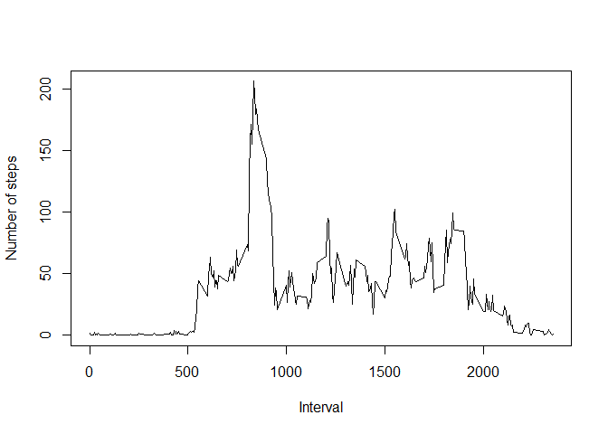
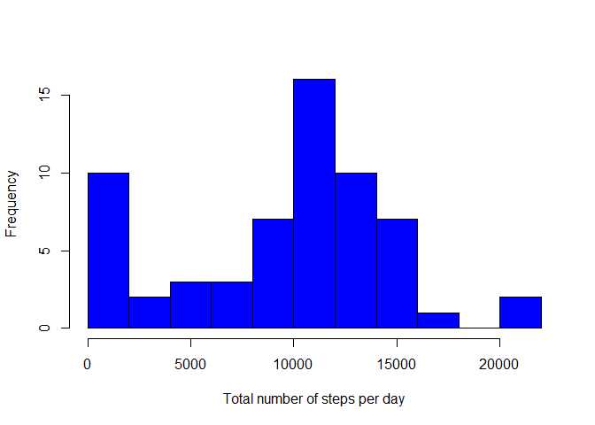
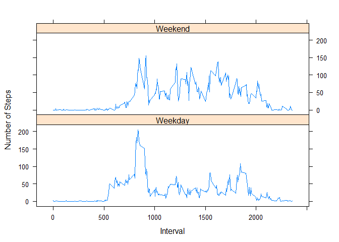

## Load some useful packages.

```r
library(lubridate)
```

```
## 
## Attaching package: 'lubridate'
```

```
## The following object is masked from 'package:base':
## 
##     date
```

```r
library(dplyr)
```

```
## 
## Attaching package: 'dplyr'
```

```
## The following objects are masked from 'package:lubridate':
## 
##     intersect, setdiff, union
```

```
## The following objects are masked from 'package:stats':
## 
##     filter, lag
```

```
## The following objects are masked from 'package:base':
## 
##     intersect, setdiff, setequal, union
```

```r
library(data.table)
```

```
## 
## Attaching package: 'data.table'
```

```
## The following objects are masked from 'package:dplyr':
## 
##     between, first, last
```

```
## The following objects are masked from 'package:lubridate':
## 
##     hour, isoweek, mday, minute, month, quarter, second, wday,
##     week, yday, year
```

```r
library(lattice)
```

## Loading and preprocessing the data

First we need to load the fitness tracker data from the website. 


```r
if (!file.exists('data')) {
        dir.create('data')
}

fileUrl <- 'https://d396qusza40orc.cloudfront.net/repdata%2Fdata%2Factivity.zip'
temp = tempfile()
download.file(fileUrl, destfile = ".\\data\\steps.zip")
fitness <- read.csv(unz(".\\data\\steps.zip", 'activity.csv'), stringsAsFactors = FALSE)

head(fitness)
```

```
##   steps       date interval
## 1    NA 2012-10-01        0
## 2    NA 2012-10-01        5
## 3    NA 2012-10-01       10
## 4    NA 2012-10-01       15
## 5    NA 2012-10-01       20
## 6    NA 2012-10-01       25
```


## What is mean total number of steps taken per day?

Now we compute the total number of steps taken each day and plot a histogram of it.

```r
total_steps_per_day <- fitness %>% group_by(date) %>% summarize(steps = sum(steps, na.rm = TRUE))

hist(total_steps_per_day$steps, breaks = 10, xlab = 'Total number of steps per day', main = '', col = 'blue')
```

<!-- -->

Next we calculate the mean and median of the total number of steps taken per day:

```r
mean_steps_per_day <- mean(total_steps_per_day$steps, na.rm = T)
median_steps_per_day <- median(total_steps_per_day$steps, na.rm = T)

print(paste('The mean number of steps per day is', round(mean_steps_per_day)))
```

```
## [1] "The mean number of steps per day is 9354"
```

```r
print(paste('The median number of steps per day is', round(median_steps_per_day)))
```

```
## [1] "The median number of steps per day is 10395"
```


## What is the average daily activity pattern?

We group the data by interval instead of date in order to compute the average number of steps in each interval across all days, and plot a time series plot of the acitivity pattern.


```r
mean_steps_by_interval <- fitness %>% group_by(interval) %>% summarize(steps = mean(steps, na.rm = TRUE))
plot(mean_steps_by_interval$interval, mean_steps_by_interval$steps, type = 'l', xlab = 'Interval', ylab = 'Number of steps')
```

<!-- -->

Next, we calculate the interval with the maximum number of steps on average:


```r
truth <- max(mean_steps_by_interval$steps)
max_steps <- mean_steps_by_interval$interval[mean_steps_by_interval$steps == truth]

print(paste('The interval with the maximum number of steps on average is',max_steps))
```

```
## [1] "The interval with the maximum number of steps on average is 835"
```

## Imputing missing values

What is the total number of missing values?

```r
missing_data <- is.na(fitness$steps)
total_missing_data <- sum(missing_data)
print(paste('The total number of missing values is', total_missing_data))
```

```
## [1] "The total number of missing values is 2304"
```

In order to devise a strategy how to impute the missing data values we first need to find out if there is some structure to which data is missing. For example, is data missing for a complete day, is data missing for one interval for all days, etc.


```r
print('Table of intervals with missing data.')
```

```
## [1] "Table of intervals with missing data."
```

```r
table(fitness$interval[missing_data])
```

```
## 
##    0    5   10   15   20   25   30   35   40   45   50   55  100  105  110 
##    8    8    8    8    8    8    8    8    8    8    8    8    8    8    8 
##  115  120  125  130  135  140  145  150  155  200  205  210  215  220  225 
##    8    8    8    8    8    8    8    8    8    8    8    8    8    8    8 
##  230  235  240  245  250  255  300  305  310  315  320  325  330  335  340 
##    8    8    8    8    8    8    8    8    8    8    8    8    8    8    8 
##  345  350  355  400  405  410  415  420  425  430  435  440  445  450  455 
##    8    8    8    8    8    8    8    8    8    8    8    8    8    8    8 
##  500  505  510  515  520  525  530  535  540  545  550  555  600  605  610 
##    8    8    8    8    8    8    8    8    8    8    8    8    8    8    8 
##  615  620  625  630  635  640  645  650  655  700  705  710  715  720  725 
##    8    8    8    8    8    8    8    8    8    8    8    8    8    8    8 
##  730  735  740  745  750  755  800  805  810  815  820  825  830  835  840 
##    8    8    8    8    8    8    8    8    8    8    8    8    8    8    8 
##  845  850  855  900  905  910  915  920  925  930  935  940  945  950  955 
##    8    8    8    8    8    8    8    8    8    8    8    8    8    8    8 
## 1000 1005 1010 1015 1020 1025 1030 1035 1040 1045 1050 1055 1100 1105 1110 
##    8    8    8    8    8    8    8    8    8    8    8    8    8    8    8 
## 1115 1120 1125 1130 1135 1140 1145 1150 1155 1200 1205 1210 1215 1220 1225 
##    8    8    8    8    8    8    8    8    8    8    8    8    8    8    8 
## 1230 1235 1240 1245 1250 1255 1300 1305 1310 1315 1320 1325 1330 1335 1340 
##    8    8    8    8    8    8    8    8    8    8    8    8    8    8    8 
## 1345 1350 1355 1400 1405 1410 1415 1420 1425 1430 1435 1440 1445 1450 1455 
##    8    8    8    8    8    8    8    8    8    8    8    8    8    8    8 
## 1500 1505 1510 1515 1520 1525 1530 1535 1540 1545 1550 1555 1600 1605 1610 
##    8    8    8    8    8    8    8    8    8    8    8    8    8    8    8 
## 1615 1620 1625 1630 1635 1640 1645 1650 1655 1700 1705 1710 1715 1720 1725 
##    8    8    8    8    8    8    8    8    8    8    8    8    8    8    8 
## 1730 1735 1740 1745 1750 1755 1800 1805 1810 1815 1820 1825 1830 1835 1840 
##    8    8    8    8    8    8    8    8    8    8    8    8    8    8    8 
## 1845 1850 1855 1900 1905 1910 1915 1920 1925 1930 1935 1940 1945 1950 1955 
##    8    8    8    8    8    8    8    8    8    8    8    8    8    8    8 
## 2000 2005 2010 2015 2020 2025 2030 2035 2040 2045 2050 2055 2100 2105 2110 
##    8    8    8    8    8    8    8    8    8    8    8    8    8    8    8 
## 2115 2120 2125 2130 2135 2140 2145 2150 2155 2200 2205 2210 2215 2220 2225 
##    8    8    8    8    8    8    8    8    8    8    8    8    8    8    8 
## 2230 2235 2240 2245 2250 2255 2300 2305 2310 2315 2320 2325 2330 2335 2340 
##    8    8    8    8    8    8    8    8    8    8    8    8    8    8    8 
## 2345 2350 2355 
##    8    8    8
```

```r
print('Table of days with missing data.')
```

```
## [1] "Table of days with missing data."
```

```r
table(fitness$date[missing_data])
```

```
## 
## 2012-10-01 2012-10-08 2012-11-01 2012-11-04 2012-11-09 2012-11-10 
##        288        288        288        288        288        288 
## 2012-11-14 2012-11-30 
##        288        288
```

```r
print(paste('Number of measurements for one day', length(unique(fitness$interval))))
```

```
## [1] "Number of measurements for one day 288"
```

```r
total_steps_per_day <- fitness %>% group_by(date) %>% summarize(steps = sum(steps, na.rm = F))

print(paste('Number of days that have no recorded tracking data',sum(is.na(total_steps_per_day$steps))))
```

```
## [1] "Number of days that have no recorded tracking data 8"
```

We can see that 8 whole days of measurements are missing. So instead of imputing missing data on a per day basis the most promising approach for now is to use the intervals from other days to impute the missing data.


```r
fitness_imputed <- copy(fitness)
missing_data_ind <- which(missing_data)
for (i in missing_data_ind) {fitness_imputed$steps[i] <- median(fitness_imputed$steps[fitness_imputed$interval == fitness_imputed$interval[i]], na.rm = TRUE)}

head(fitness_imputed)
```

```
##   steps       date interval
## 1     0 2012-10-01        0
## 2     0 2012-10-01        5
## 3     0 2012-10-01       10
## 4     0 2012-10-01       15
## 5     0 2012-10-01       20
## 6     0 2012-10-01       25
```

Let's see how the data has changed after the missing values have been replaced with the median value of the other intervals.


```r
total_steps_per_day_imputed <- fitness_imputed %>% group_by(date) %>% summarize(steps = sum(steps, na.rm = TRUE))

hist(total_steps_per_day_imputed$steps, breaks = 10, xlab = 'Total number of steps per day', main = '', col = 'blue')
```

<!-- -->

```r
mean_steps_per_day_imputed <- mean(total_steps_per_day_imputed$steps)
median_steps_per_day_imputed <- median(total_steps_per_day_imputed$steps)

print(paste('The mean number of steps per day after imputing missing values is', round(mean_steps_per_day_imputed)))
```

```
## [1] "The mean number of steps per day after imputing missing values is 9504"
```

```r
print(paste('The median number of steps per day after imputing missing values is', round(median_steps_per_day_imputed)))
```

```
## [1] "The median number of steps per day after imputing missing values is 10395"
```

We see that the mean number of steps has increased while the median number of steps has remained unchanged.


## Are there differences in activity patterns between weekdays and weekends?

In the last part we will check if there are differences during weekdays and weekends for the activity patterns.


```r
workday <- c('Monday','Tuesday','Wednesday', 'Thursday', 'Friday')
fitness_imputed$weekend <- ifelse(weekdays(ymd(fitness_imputed$date)) %in% workday,'Weekday','Weekend')
fitness_imputed$weekend <- factor(fitness_imputed$weekend, levels = c('Weekday', 'Weekend'))

head(fitness_imputed)
```

```
##   steps       date interval weekend
## 1     0 2012-10-01        0 Weekday
## 2     0 2012-10-01        5 Weekday
## 3     0 2012-10-01       10 Weekday
## 4     0 2012-10-01       15 Weekday
## 5     0 2012-10-01       20 Weekday
## 6     0 2012-10-01       25 Weekday
```

Plot the average activity pattern for weekdays and weekends.

```r
fitness_imputed_weekday <- fitness_imputed %>% group_by(weekend, interval) %>% summarize(steps = mean(steps, na.rm = TRUE))

xyplot(steps ~ interval | weekend, data = fitness_imputed_weekday, layout = c(1,2), xlab = 'Interval', ylab = 'Number of Steps', type = 'l')
```

<!-- -->

What we could do next:
As the activity pattern for weekdays and weekends is noticeably different we should test how the results change if we impute missing data separately for these two. 
